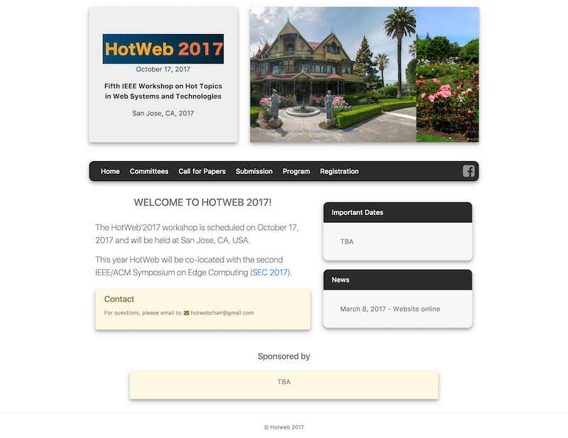
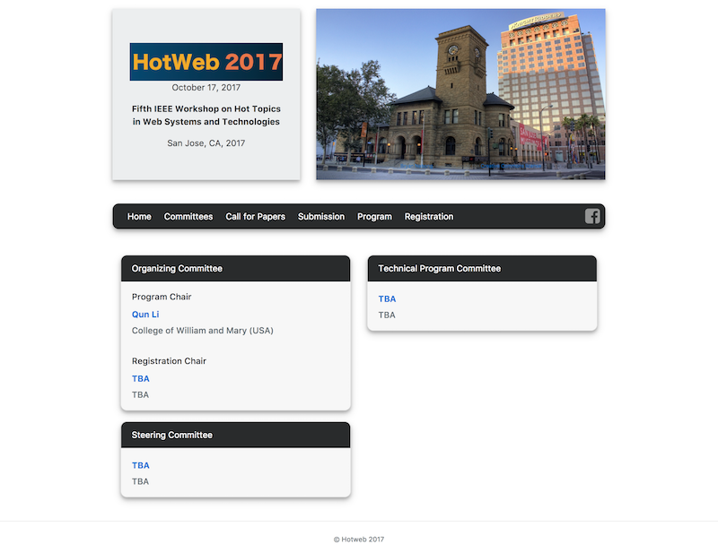
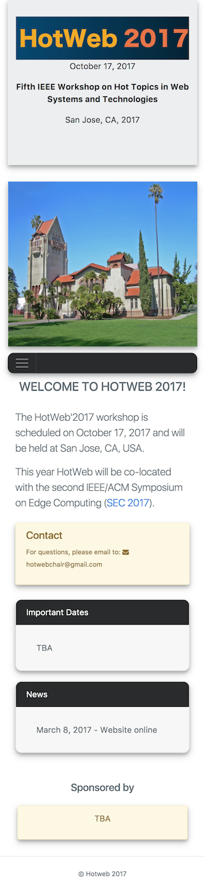

# Jekyll-Conference-Template

An academic conference website template built using Jekyll.

## Features

- A data file (`_data/conference.yml`) to configure all conference information.
    - `full_title`: conference fullname e.g., First xxx conference on xxxx, 2017.
    - `short_title`: conference shortname e.g., xxxx2017
    - `descriptioin`: short description about the conference (< 160 char)
    - `location`: conference location
    - `logo_path`: conference logo
    - `slideshow`: images slideshow
    - `navbar`: navigation menu.
    - `news`: news section.
    - `sponsors`: sponsor section.
    - `deadlines`: important dates of deadlines, pass-due date will be automatically printed with del line.
    - `social_media`: social media on the navbar. (current support facebook and twitter.)
    - `organizing_committees`: organzizing committees
    - `steering_committees`: steering committees
    - `technical_program_committees`: technical program committees
    - more configuratioins to come.
- Google Analytics: in `_config.yml`
- Font-awesome
- Bootstrap v4.

## Preview

### home page

### committees page

### Deadlines

### Admin page

### mobile version

## Usage

### with Jekyll Admin.

## TODO

 - [ ] add https://www.timeanddate.com/ link to deadlines.
 - [ ] seperate some layouts/includes into a theme, make the project extensible with different themes.
 - [x] Jekyll-admin integrated
 - [ ] use Jekyll posts to update news.
 - [ ] clean Jekyll pages, put html code into layout/includes, pure markdown in pages. 
 - [ ] Makefile integration for docker run, ssh upload, rsync